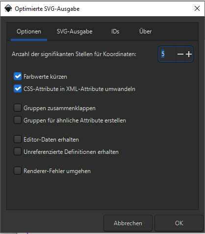
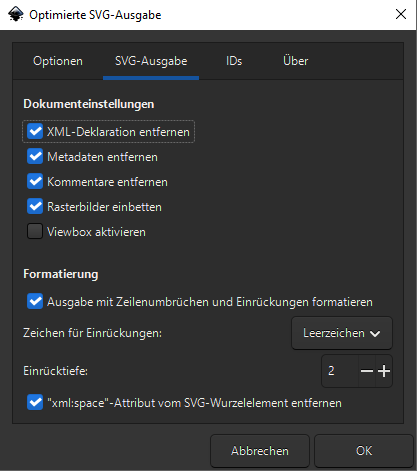
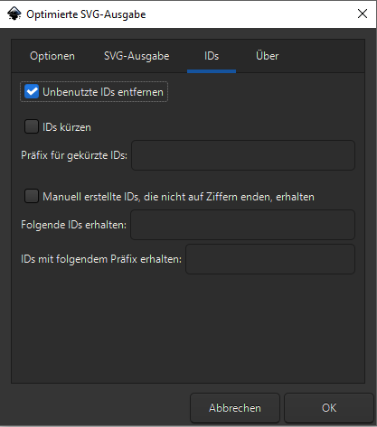

# Erstellen einer Spielkartenvoralge

Das erstellen einer SVG-Spielkartenvorlage kann mit Inkskape erfolgen.

Die Vorlage [Spielkarte 59x91 mm](../templates/Spielkarte 59x91 mm.svg) aus dem templates ordner in den lokalen Ordner `%APPDATA%\Inkscape\templates` kopieren.

Nach dem Starten von inkscape auf der Startseite erscheint unter Benutzerdefiniert die obige Vorlage.

## Erstellen eines Data Fields

Einem Text soll ein Datenfeld zugeordnet werden, so das dieser automatisch ersetzt wird.

1. Das Textobjekt auswählen am besten über das Fenster `Ebenen und Objekte`.
2. In den XML-Editor wechseln (`Umschalt-Strg-X`)
   - In dem Ausgewählten Knoten über das + ein neues Attribut anlegen
   - das Attribut `data-field` nennen
   - dem Attribut einen Wert zuweisen. z.B.: `description`, `long_name` o.ä. (siehe [Aktuelle CSV-Spalten](../readme.md#aktuelle-csv-spalten))

## Exportieren eins Druck-Templates

Wenn die Vorlage fertig  ist, dann kann man das SVG als template speichern.

Dies geht am besten mit `Kopie speichern ...`.
- In dem Dialog den template Ordener auswählen.
- Als Dateityp `Optimiertes SVG (*.svg)` auswählen.
- mit `Speichern` bestätigen

Jetzt erscheint ein Dialog um die Einstellungen für das Optimieren zu konfigurieren:

