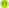
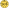
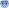
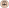
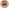

## Status der NSCs

Der Status der NSCs kann mit kleinen Spielsteien auf der Karte markiert werden.

| Symbol | Name | Beschreibung | Statuswechsel |
|---|---|---|---|
| | Abgelenkt |   |  |
| | Angeschlagen | |  |
| | Benommen |   |  |
| | Festgehalten |   |  |
| | Gebunden |  |  |
| | Verwundbar |   |  |

## Weitere Symbole

Weitere Symbole und deren Bedeutung.

| Symbol | Name | Beschreibung |
|---|---|---|
| | Parade |   |
| | Geschwindigkeit |   |
| | Robustheit / Rüstung |   |
| | Gruppe Söldner | Der NSC benötigt eine Gruppe von Söldnern. Weitere NSCs müssen von dem Söldner Stapel gezogen werden. |
| | Gruppe Kultisten | Der NSC benötigt eine Gruppe von Kultisten. Weitere NSCs müssen von dem Kultisten Stapel gezogen werden. |
| | Gruppe Schläger | Der NSC benötigt eine Gruppe von Schlägern. Weitere NSCs müssen von dem Schläger Stapel gezogen werden. |
| | Gruppe Bestien | Der NSC benötigt / beschwört eine oder mehrere Bestien. Diese müssen von dem Bestien-Stapel gezogen werden.  |
